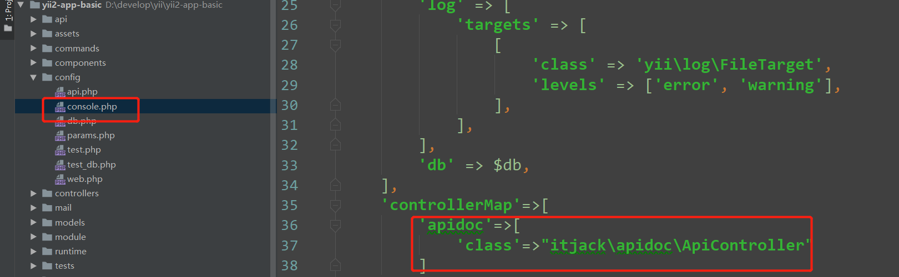

# 安装

composer require itjackjw/yii2-apidoc dev-master

# 添加配置文件


```
<?php
return[
    ['title'=>'首页模块','author'=>"小明",'apimodule'=>"api","output"=>"index.html"],
    ['title'=>'admin模块','author'=>"小明",'apimodule'=>"module\admin\api","output"=>"admin.html"]
];


title:文件的标题
author：作者
apimodule：要生成的模块路径地址
output：生成的文件名称

```


## 使用

关联控制器




主要有两种方式

1.导出一个模块的api 文档

yii  apidoc/index   

-m=要生成的模块类

-f=是否覆盖之前的文件

-o=输出文件的名字

-t=文件标题

-a=作者


2.导出配置文件内所有的api文档

yii  apidoc/all


/**
     * 测试方法
     *
     * @ApiTitle    (测试名称)
     * @ApiSummary  (测试描述信息)
     * @ApiMethod   (POST)
     * @ApiSector   (测试分组)
     * @ApiRoute    (/api/demo/test/id/{id}/name/{name})
     * @ApiHeaders  (name=token, type=string, required=true, description="请求的Token")
     * @ApiParams   (name="id", type="integer", required=true, description="会员ID")
     * @ApiParams   (name="name", type="string", required=true, description="用户名")
     * @ApiParams   (name="data", type="object", sample="{'user_id':'int','user_name':'string','profile':{'email':'string','age':'integer'}}", description="扩展数据")
     * @ApiReturnParams   (name="code", type="integer", required=true, sample="0")
     * @ApiReturnParams   (name="msg", type="string", required=true, sample="返回成功")
     * @ApiReturnParams   (name="data", type="object", sample="{'user_id':'int','user_name':'string','profile':{'email':'string','age':'integer'}}", description="扩展数据返回")
     * @ApiReturn   ({
    'code':'1',
    'msg':'返回成功'
    })
     */
